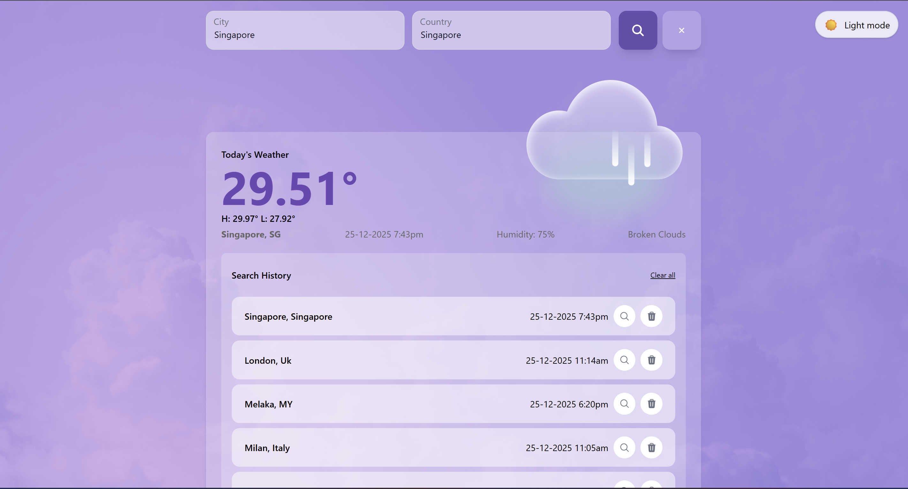
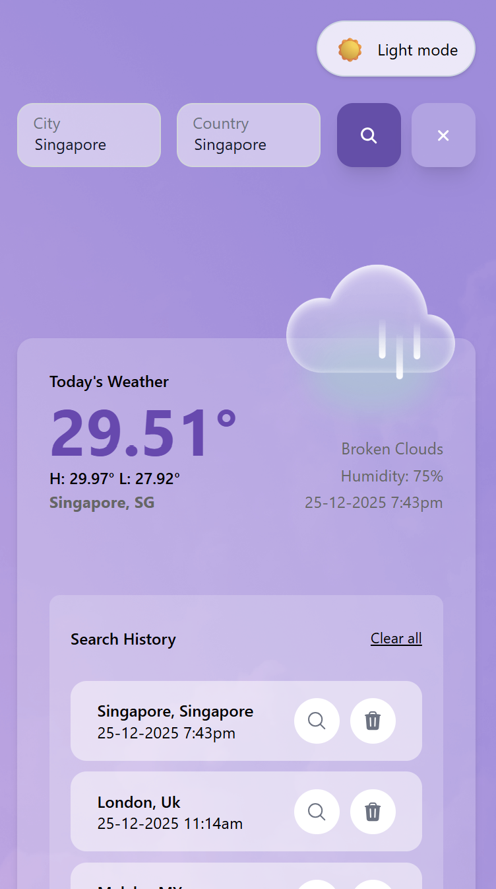
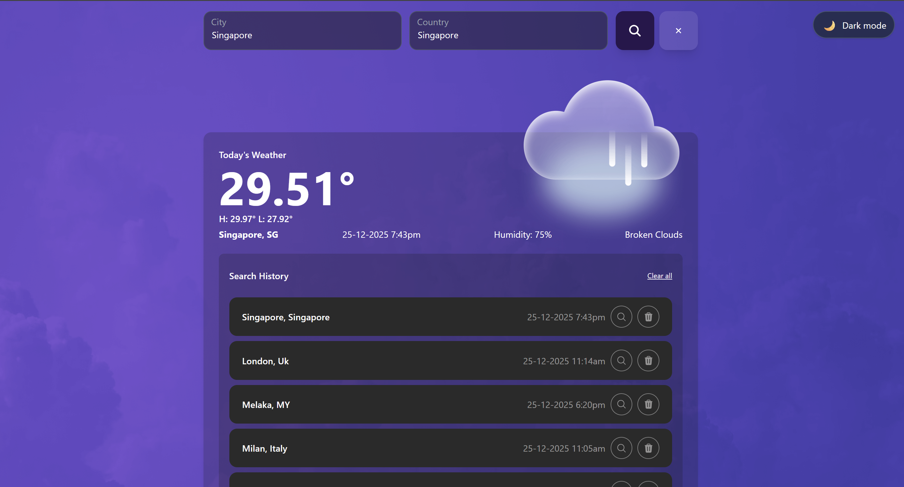

# 🌤️ Weather App

A modern and user-friendly weather application built with **React + TypeScript + Tailwind CSS**.  
Users can search weather by **City + Country**, view real-time conditions, browse search history and toggle **Dark / Light mode**.

---

## 🎨 UI & Design Reference

This project strictly follows the design from Figma:

👉 https://www.figma.com/file/4QjlaIXuvEEMUdvvBKjDZH/Weather-App?node-id=0%3A1&t=uTr6LSt1NTovAc

Weather API Source:

👉 https://api.openweathermap.org

## ⚙️ Environment Setup

You MUST configure environment variables before running.

1️⃣ Copy `.env.example`  
2️⃣ Create `.env` in project root  
3️⃣ Fill in your OpenWeather API key

## 📦 Features

### 🔍 Weather Search

- Search by city + country
- Weather fetched from **OpenWeather API**
- Axios used for API requests
- Displays:
  - Current temperature
  - High & Low temperature
  - Humidity
  - Weather description
  - Local date & time of the searched location

### 🕑 Search History

- Stores history locally
- Click to re-search
- Delete individual record
- **Delete confirmation modal added** to prevent accidental removal
  

### 🌓 Theme Support

- Light Mode
- Dark Mode

### 📱 Fully Responsive

- Mobile friendly
- Matches provided Figma design

---

## 🖼️ Preview

### 💻 Desktop Preview

---

### 📱 Mobile Preview

---

### 🌙 Dark Mode Preview

---

## 🌤️ Weather Icon Logic (Self Assumption)

Since only **two weather images** were provided:

- ☀️ Sun
- ☁️ Cloud

So this logic is implemented:

| Condition         | Icon Shown |
| ----------------- | ---------- |
| `"clear"` weather | Sun        |
| Any other weather | Cloud      |

This ensures consistency with available assets.
